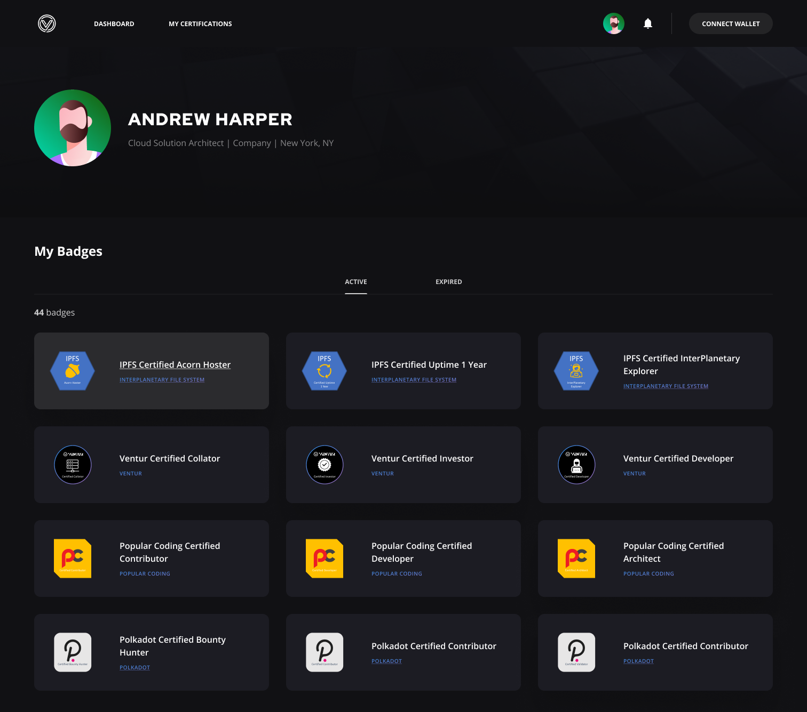

> **Warning**  
> This Project is a Work in Progress and not in a state that would be suitable for a Production deployment without significant updates.

# 

# Ventur Verified
Ventur Verified is a credentialing decentralized application (dApp) built on top of the [Ventur Network](https://github.com/Popular-Coding/ventur).

## Overview
Ventur Verified is a credentialing dApp that allows you to create, assign, accept, and manage non-transferable credentials.  

Built on top of Ventur’s Non-Transferable NFTs (NT-NFTs), Ventur Verified allows for the managment of credentials in the Polkadot Ecosystem, enabling automated credential verification for job applications, rfp proposals, content access, and more.


### Problem Statement
Blockchains and the Web3 space introduce a new, "trustless" paradigm, where interactions no longer need to rely on trust between two parties; instead, all contracts are verified, which means an individual's transactions, credentials, and identity are recorded immutably on-chain. 

Thanks to this trustless paradigm, we can verify an individual's actions in the blockchain ecosystem. You no longer have to rely on trusting someone's reputation, as their history of interactions is recorded and verified on-chain. 

However, for an end-user, checking records is a multi-step process, and depending on what you are looking to verify, this could require parsing through significant amounts of data to verify what you are looking for.  While blockchain explorers do exist for this purpose, this is not conducive to quick interperson interactions or rapid decision making.


### Ventur Verified as a Solution
Ventur Verified capitalizes on Ventur's NT-NFTs by introducing them as certifications. Any certification authority can create their own collection of NT-NFTs and assign individual tokens to accounts depending on their criteria. 

NT-NFT certifications can be asigned based on on-chain interactions. This could mean certifying addresses that have been able to keep a Polkadot Validator running successfully without downtime or slashes for a year. 

A company might also present certifications for off-chain accomplishments, such as certification exams or courses.

An NT-NFT assigned to an account cannot be re-assigned to another account.

Ventur Verified enables:

- Creating and maintaining certifications with a few clicks of a button.
- Present certifications on an easy-to-digest account profile. 
- Easily identify, manually or programatically, whether a user's certifications meet the desired qualifications for a contract. 

All in all, Ventur Verified aims to streamline the process of making reliable connections to setting up contracts. 

### User Interface

#### User Flows

#### UI Design
##### User Profile

##### Badge Details

##### Badge Creation and Management
###### Manage

###### Create

### Technical Documentation

#### Architecture

### Next Steps
- Refine UI Iteratively with User Testing
- Launch dApp on Ventur Testnet
- Enable Cross Chain Credentialing using [XCM](https://polkadot.network/cross-chain-communication/)
- Engage Strategic Partners
- Develop and Release Paired Offering - Ventur Subscribed - Subscriptions based off of the NT-NFT solution that underpins Ventur Verified


## Running Ventur Verified

### Prerequisites

In order to run the Ventur Verified dApp, you will need to install Node and Yarn.

You will also need to clone the Ventur repository and run a node locally, as Ventur Verified will look for a local Ventur node to connect to.

### Setup

```bash
yarn install
```

### Usage

You can start the template in development mode to connect to a locally running node

```bash
yarn start
```

You can also build the app in production mode,

```bash
yarn build
```

and open `build/index.html` in your favorite browser.

### Related Work

* [`Ventur Network`](https://github.com/Popular-Coding/ventur)

License: GPLv3
